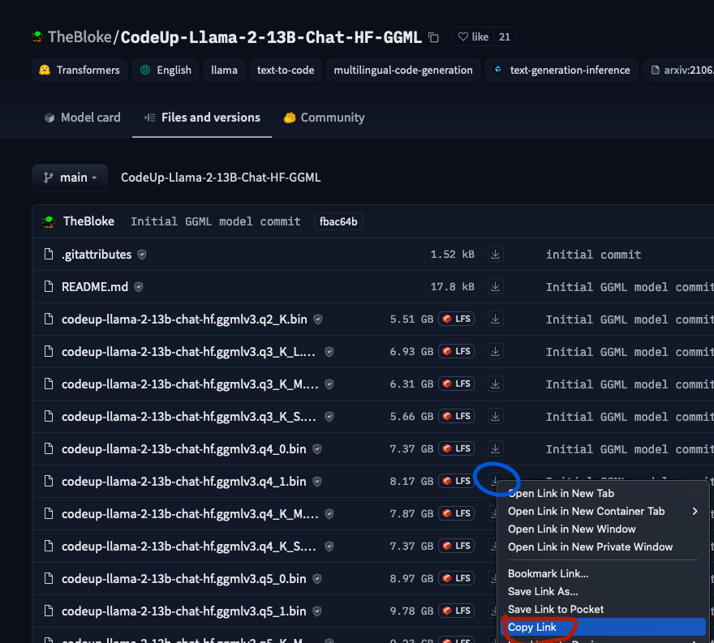
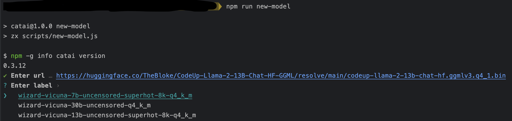

# Adding/Updating a model

If you want to add a model, you can follow the steps below.

- Check the model does not exist in the `models.json` file.
- Check the model locally and make sure it works. (`catia install model-url`)
- clone the repo
- run `npm install`
- run `npm new-model`

Copy link to the model:


** If you update the model, make sure the tag is the same as the old one.



If the tag exits, it will autocomplete it for you.

- commit the change: `new-model: model name`
- create a pull request

## Extra configuration

You can add extra configuration to the model in the `models.json`
In the settings section, add configuration like this:

```json
{
  "settings": {
    ...
  }
}
```

### Node-Llama-CPP Settings

Check out the configuration options in
here [Node-Llama-CPP](https://withcatai.github.io/node-llama-cpp/classes/LlamaModel.html#constructor)

## <a name="commit"></a> Commit Message Guidelines

This repository has very precise rules over how git commit messages can be formatted.
This leads to **more readable messages** that are easy to follow when looking through **project history**.
But also, git commit messages as used to **generate changelog**.

### Commit Message Format

Each commit message consists of a **header**, a **body** and a **footer**.
The header has a special format that includes a **type** and a **subject**:

```
<type>: <subject>
<BLANK LINE>
<body>
<BLANK LINE>
<footer>
```

Any line of the commit message cannot be longer 100 characters!
This allows the message to be easier to read on GitHub as well as in various git tools.

### Revert

If the commit reverts a previous commit, it should begin with `revert: `, followed by the header of the reverted commit.
In the body it should say: `This reverts commit <hash>.`, where the hash is the SHA of the commit being reverted.

### Type

Must be one of the following:

* **feat**: A new feature
* **fix**: A bug fix
* **docs**: Documentation only changes
* **style**: Changes that do not affect the meaning of the code (white-space, formatting, missing semi-colons, etc)
* **refactor**: A code change that neither fixes a bug nor adds a feature
* **perf**: A code change that improves performance
* **test**: Adding missing tests or correcting existing tests
* **build**: Changes that affect the build system, CI configuration or external dependencies
* **chore**: Other changes that don't modify `src` or `test` files

### Subject

The subject contains a succinct description of the change:

* use the imperative, present tense: "change" not "changed" nor "changes"
* don't capitalize the first letter
* no dot (.) at the end

### Body

Just as in the **subject**, use the imperative, present tense: "change" not "changed" nor "changes".
The body should include the motivation for the change and contrast this with the previous behavior.

### Footer

The footer should contain any information about **Breaking Changes**
and is also the place to reference GitHub issues that this commit **Closes**.

**Breaking Changes** should start with the word `BREAKING CHANGE:` with a space or two newlines.
The rest of the commit message is then used for this.

### Examples

Fix and close issue:

```
fix: resolve issues with model loading

Closes: #123456
```

Implement new feature:

```
feat: support more model type

This new feature adds support for importing model types 1, 2, and 3.

Closes: #22222
```

Docs update:

```
docs: update documentation for `prompt` function
```

Breaking change:

```
refactor: refactor function `prompt`

BREAKING CHANGE: description of breaking change in `prompt`
```

