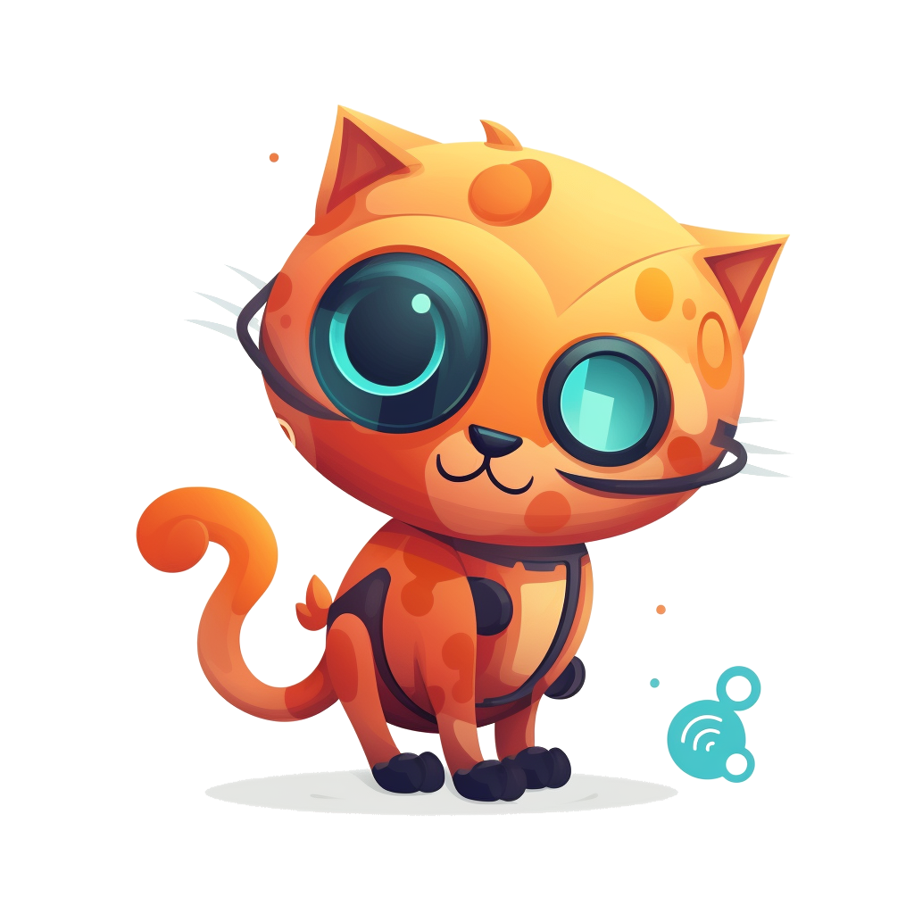

<div align="center">
    
    <h1>CatAI</h1>
</div>

<div align="center">

[](https://github.com/withcatai/catai/actions/workflows/build.yml)
[](https://www.npmjs.com/package/catai)
[](https://www.npmjs.com/package/catai)
[](https://www.npmjs.com/package/catai)

</div>
<br />

Run GGUF models on your computer with a chat ui.

> Your own AI assistant runs locally on your computer.

Inspired
by [Node-Llama-Cpp](https://github.com/withcatai/node-llama-cpp), [Llama.cpp](https://github.com/ggerganov/llama.cpp)

## Installation & Use

Make sure you have [Node.js](https://nodejs.org/en/) (**download current**) installed.

```bash
npm install -g catai

catai install llama3-8b-openhermes-dpo-q3_k_s
catai up
```


## Features
- Auto detect programming language 🧑‍💻
- Click on user icon to show original message 💬
- Real time text streaming ⏱️
- Fast model downloads 🚀

## CLI

```
Usage: catai [options] [command]

Options:
  -V, --version                    output the version number
  -h, --help                       display help for command

Commands:
  install|i [options] [models...]  Install any GGUF model
  models|ls [options]              List all available models
  use [model]                      Set model to use
  serve|up [options]               Open the chat website
  update                           Update server to the latest version
  active                           Show active model
  remove|rm [options] [models...]  Remove a model
  uninstall                        Uninstall server and delete all models
  node-llama-cpp|cpp [options]     Node llama.cpp CLI - recompile node-llama-cpp binaries
  help [command]                   display help for command
```

### Install command

```
Usage: cli install|i [options] [models...]

Install any GGUF model

Arguments:
  models                Model name/url/path

Options:
  -t --tag [tag]        The name of the model in local directory
  -l --latest           Install the latest version of a model (may be unstable)
  -b --bind [bind]      The model binding method
  -bk --bind-key [key]  key/cookie that the binding requires
  -h, --help            display help for command
```

### Cross-platform

You can use it on Windows, Linux and Mac.

This package uses [node-llama-cpp](https://github.com/withcatai/node-llama-cpp) which supports the following platforms:

- darwin-x64
- darwin-arm64
- linux-x64
- linux-arm64
- linux-armv7l
- linux-ppc64le
- win32-x64-msvc


### Good to know
- All download data will be downloaded at `~/catai` folder by default.
- The download is multi-threaded, so it may use a lot of bandwidth, but it will download faster!

## Web API

There is also a simple API that you can use to ask the model questions.

```js
const response = await fetch('http://127.0.0.1:3000/api/chat/prompt', {
    method: 'POST',
    body: JSON.stringify({
        prompt: 'Write me 100 words story'
    }),
    headers: {
        'Content-Type': 'application/json'
    }
});

const data = await response.text();
```

For more information, please read the [API guide](https://github.com/withcatai/catai/blob/main/docs/api.md)

## Development API + Node-llama-cpp@beta integration

You can use the model with [node-llama-cpp@beta](https://github.com/withcatai/node-llama-cpp/pull/105)

CatAI enables you to easily manage the models and chat with them.

```ts
import {downloadModel, getModelPath} from 'catai';

// download the model, skip if you already have the model
await downloadModel(
    "https://huggingface.co/QuantFactory/Meta-Llama-3-8B-Instruct-GGUF/resolve/main/Meta-Llama-3-8B-Instruct.Q2_K.gguf?download=true",
    "llama3"
);

// get the model path with catai
const modelPath = getModelPath("llama3");

const llama = await getLlama();
const model = await llama.loadModel({
    modelPath
});

const context = await model.createContext();
const session = new LlamaChatSession({
    contextSequence: context.getSequence()
});

const a1 = await session.prompt("Hi there, how are you?");
console.log("AI: " + a1);
```

## Configuration

You can edit the configuration via the web ui.

More information [here](https://github.com/withcatai/catai/blob/main/docs/configuration.md)

## Contributing

Contributions are welcome!

Please read our [contributing guide](./CONTRIBUTING.md) to get started.

## License

This project uses [Llama.cpp](https://github.com/ggerganov/llama.cpp) to run models on your computer.
So any license applied to Llama.cpp is also applied to this project.


<br />

<div align="center" width="360">
    
    <br/>
    <p align="right">
        <i>If you like this repo, star it ✨</i>&nbsp;&nbsp;&nbsp;&nbsp;&nbsp;&nbsp;&nbsp;&nbsp;&nbsp;&nbsp;&nbsp;&nbsp;&nbsp;&nbsp;&nbsp;&nbsp;&nbsp;&nbsp;&nbsp;&nbsp;&nbsp;&nbsp;&nbsp;&nbsp;&nbsp;&nbsp;&nbsp;&nbsp;&nbsp;&nbsp;&nbsp;&nbsp;&nbsp;&nbsp;&nbsp;&nbsp;&nbsp;&nbsp;&nbsp;&nbsp;&nbsp;&nbsp;&nbsp;&nbsp;&nbsp;&nbsp;&nbsp;&nbsp;&nbsp;&nbsp;&nbsp;&nbsp;
    </p>
</div>
