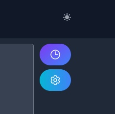
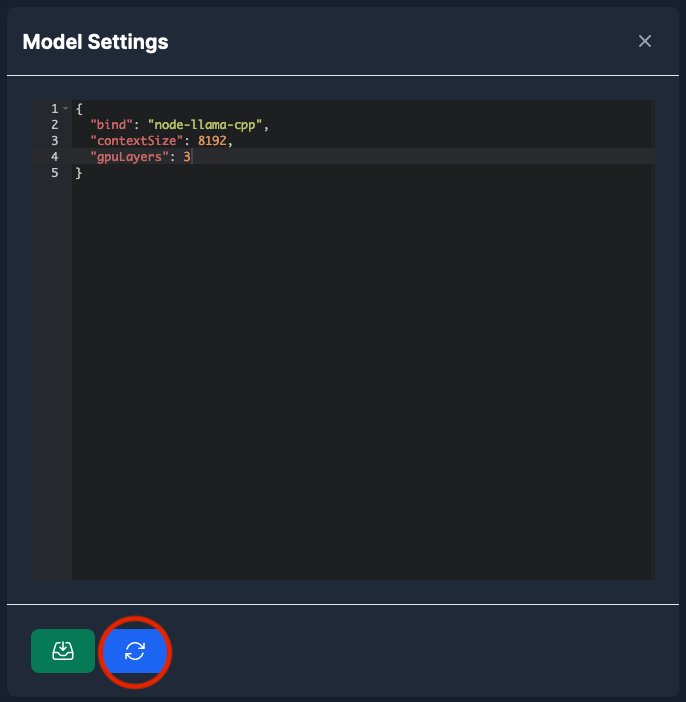

# Configuration

How to configure the Model to optimize it for your needs.

The configuration mostly depends on the model binding, for most cases is `llama.cpp`.

You can config the model by the following steps:

1. Click on the settings button on the CatAI chat WebUI:

   

2. Edit configuration (JSON file):

   If the model binding is `node-llama-cpp` or `node-llama-cpp-v2`, You can find the configuration
   here:

   [LlamaContextOptions](https://withcatai.github.io/node-llama-cpp/api/type-aliases/LlamaContextOptions)

   [LLamaChatPromptOptions](https://withcatai.github.io/node-llama-cpp/api/type-aliases/LLamaChatPromptOptions)

3. Restart the server.
   

